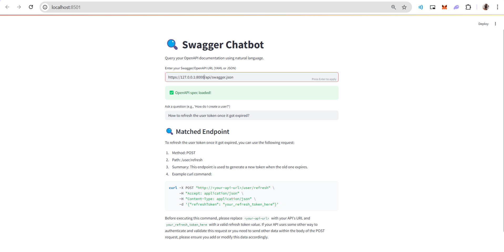

# Swagger Chatbot 🚀

A Streamlit application that lets you interact with Swagger/OpenAPI documentation using natural language queries via OpenAI GPT-4.
 
## Features

* **Dynamic Swagger URL Input**: Enter any public Swagger/OpenAPI URL (YAML or JSON).
* **Automatic Spec Parsing**: Fetches and parses the specification file.
* **Natural Language Queries**: Ask questions like "How do I create a user?" or "List available endpoints for orders."
* **Endpoint Matching**: Uses GPT-4 to match your query with the best API endpoint.
* **Example Request Generation**: Provides example `curl` commands with dummy bodies if needed.

## Requirements

* Python 3.8+
* Streamlit
* OpenAI Python SDK
* PyYAML
* Requests

Install dependencies with:

```bash
pip install streamlit openai pyyaml requests
```

## Setup

1. Clone the repository:

   ```bash
   
   

      git clone [https://github.com/HassanRehman11/bots.git](https://github.com/HassanRehman11/bots.git)
      cd bots/swagger-chatbot

````

2. Add your OpenAI API key to Streamlit secrets:

   Create a file at `.streamlit/secrets.toml` with:
   ```toml
   OPENAI_API_KEY = "your_openai_api_key"
````

3. Run the app:

   ```bash
  

      streamlit run app.py

````

4. Open the provided local URL (usually `http://localhost:8501`).

## Usage

1. **Enter Swagger URL**: Paste your OpenAPI spec URL, e.g.: `https://petstore.swagger.io/v2/swagger.json`.
2. **Load Confirmation**: You should see a success message when the spec is loaded.
3. **Ask a Question**: Type a natural language question in the input box.
4. **View Matched Endpoint**: The matched method, path, summary, and example `curl` command will appear.

## Example


```bash
Enter URL: https://petstore.swagger.io/v2/swagger.json
Ask: "How do I add a new pet?"

Matched Endpoint:
1. Method: POST
2. Path: /pet
3. Summary: Add a new pet to the store
4. Example curl:

```bash
curl -X POST https://petstore.swagger.io/v2/pet \
  -H "Content-Type: application/json" \
  -d '{"name": "Fluffy", "photoUrls": []}'
````

```
